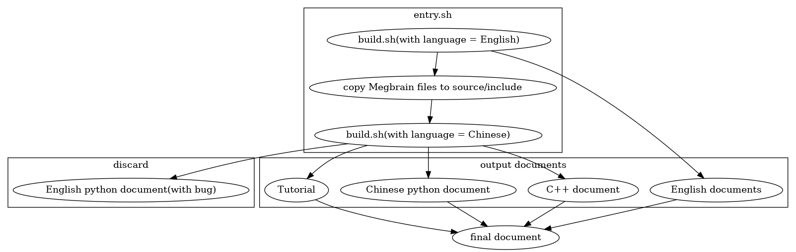

# MegEngine Documents

## Prerequisites

- Install `sphinx>=2.0` and related dependencies by:
    ```
    pip3 install -U sphinx sphinx-autodoc-typehints sphinx-serve sphinx-intl sphinxcontrib-jupyter nbsphinx jieba polib
    pip3 install git+https://github.com/pandas-dev/pydata-sphinx-theme.git@master
    ```
- reStructuredText (RST) is used for document writing. HTML files can be generated from the RST files for document visualization.

    For more information about RST, please visit https://sphinx-doc-zh.readthedocs.io/en/latest/rest.html.

- Install doxygen and exhale for C++ doc building

    Make sure you have installed necessary build tools (i.e. g++, python, cmake, flex, bison)

    Install doxygen: 
    ```
    git clone https://github.com/doxygen/doxygen.git
    cd doxygen
    mkdir build
    cd build
    cmake -G "Unix Makefiles" ..
    make
    make install
    ```
    Install exhale:
    ```
    pip install exhale
    ```

## Generate document

1. Make sure you have installed [MegEngine](https://github.com/MegEngine/MegEngine).

    ```bash
    pip3 install megengine -f https://megengine.org.cn/whl/mge.html
    ```

2. Make sure you have cloned [MegBrain](https://git-core.megvii-inc.com/brain-sdk/MegBrain)

    ```bash
    git clone git@git-core.megvii-inc.com:brain-sdk/MegBrain.git
    ```

3. Run [gen_docs/build_api.sh](gen_docs/build_api.sh) to generate HTML files of api.
    The script accepts the MegEngine source root path and MegEngine python path as the argument.

    ```bash
    ./gen_docs/build_api.sh $MEGENGINE_SOURCE_ROOT $MEGENGINE_PYTHONPATH(optional)
    ```

    Note that the html files generated from python docstring are put under `build_api/html/`.

4. Run [gen_docs/build_doc.sh](gen_docs/build_doc.sh) to generate HTML files of doc.

    set `api_url` in [source/conf.py](source/conf.py) or setup `API_DOC_URL` by `export API_DOC_URL=$url_of_api`
   ```bash
    ./gen_docs/build_doc.sh
   ```
    Note that the html files of doc are put under `build_doc/html/`.

5. Run [gen_docs/build_search.sh](gen_docs/build_search.sh) to build global search for doc and api.

   ```bash
    ./gen_docs/build_search.sh
   ```

6. Start local sphinx service of api by:
    ```bash
    sphinx-serve -b build_api -p 8000
    ```
7. Start local sphinx service of doc by:
    ```bash
    sphinx-serve -b build_doc -p 7000
    ```

* Note that the doc and api can also be generated by [gen_docs/build_all.sh](gen_docs/build_all.sh). It will build doc, api, and global search index together.

    ```bash
    ./gen_docs/build_all.sh $MEGENGINE_SOURCE_ROOT $MEGENGINE_PYTHONPATH(optional)

    sphinx-serve -b build -p 8000
    ```

* Note: basically open sourced [MegEngine](https://github.com/MegEngine) source code and python library should be used. There are always some risks about releasing internal code when internal MegBrain is specified here.


## API Translation

Once `build_api.sh` is executed, translation to Chinese is needed for us.

```bash
./gen_docs/gendoc4trans.sh $MEGENGINE_PYTHONPATH
```

This will update the `source_api/locale/zh_CN/LC_MESSAGES/zh/api/megengine.*.po` files.

Finally, run `build_api.sh` again to update zh html pages.

In order to help with the translation procedure, run following command to see the progress:

```bash
python3 utils/translate_process_summary.py /data/docs/source_api/locale/zh_CN/LC_MESSAGES/zh/api/
```


## Write python API document

* How documents are generated for python codes
    1. Write comments following docstring rules.
    2. Run sphinx tool to generate RST files from python docstring.
    3. Generate HTML files from RST.

    Refer to [gen_docs/build.sh](gen_docs/build.sh) for more details.

* Example python docstring: see [gen_docs/example/example.py](gen_docs/example/example.py).

## Run doctest in API document

API docstring also contains examples written by [doctest](https://docs.python.org/3/library/doctest.html). Run the tests by

```bash
gen_docs/build_api.sh $MEGENGINE_SOURCE_ROOT $MEGENGINE_PYTHONPATH(optional)
sphinx-build -b doctest source_api build_api/doctest

gen_docs/build_doc.sh
sphinx-build -b doctest source build_doc/doctest
```

If all tests are passed, you shall see the following similar printouts:

```
Doctest summary
===============
   16 tests
    0 failures in tests
    0 failures in setup code
    0 failures in cleanup code
build succeeded.
```

Otherwise, please fix any failed test or warning.

## Insert C++ doc hyperlink

1. For class referencing:

find the class rst file and copy its name and replace the doc with
```
:ref:`exhale_class_<filename without .rst>`
```

2. For file referencing:

find the file and copy its name and replace the doc with
```
:ref:`file_file_<filename>`
```

## Process of generate document


## Preview link

Run CI to generate preview link. Manually trigger is required.

preview url of doc: https://oss.iap.hh-b.brainpp.cn/megengine-doc/doc-new/doc

preview url of api: https://oss.iap.hh-b.brainpp.cn/megengine-doc/doc-new/api/latest