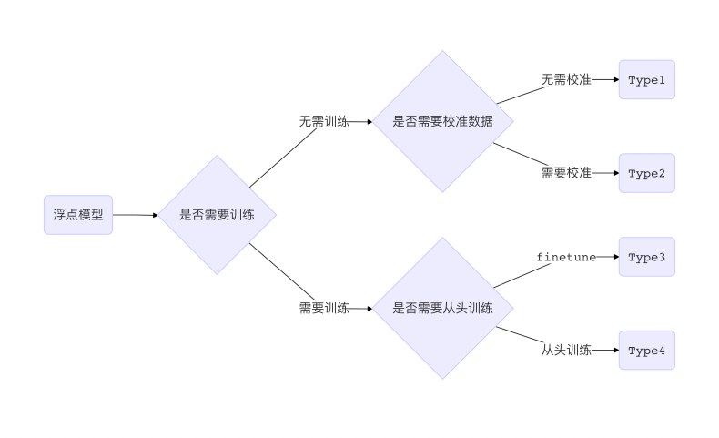
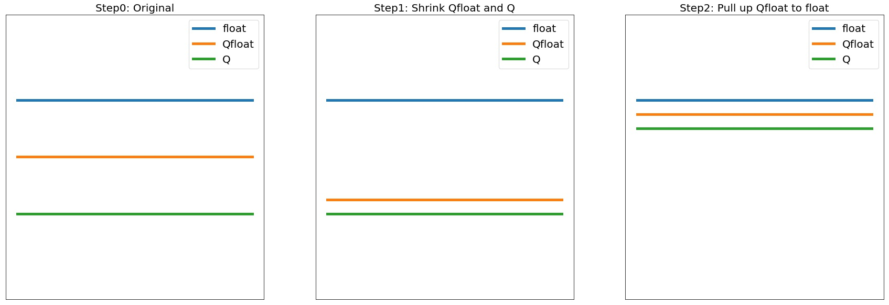

.. _quantization:

量化
==============================

量化指的是将浮点数模型（一般是32位浮点数）的权重或激活值用位数更少的数值类型（比如8位整数、16位浮点数）来近似表示的过程。
量化后的模型会占用更小的存储空间，还能够利用许多硬件平台上的专属算子进行提速。比如在 MegEngine 中使用8位整数来进行量化，相比默认的32位浮点数，模型大小可以减少为1/4，而运行在特定的设备上其计算速度也能提升为2-4倍。

量化的目的是为了追求极致的推理计算速度，为此舍弃了数值表示的精度，直觉上会带来较大的模型掉点，但是在使用一系列精细的量化处理之后，其掉点可以变得微乎其微，并能支持正常的部署使用。而且近年来随着专用神经网络加速芯片的兴起，低比特非浮点的运算方式越来越普及，因此如何把一个 GPU 上训练的浮点数模型转化为低比特的量化模型，就成为了工业界非常关心的话题。

一般来说，得到量化模型的转换过程按代价从低到高可以分为以下4种：

    图1. 量化转换过程分类

* Type1 和 Type2 由于是在模型浮点模型训练之后介入，无需大量训练数据，故而转换代价更低，被称为后量化（Post Quantization）；
* Type3 和 Type4 则需要在浮点模型训练时就插入一些假量化（FakeQuantize）算子，模拟计算过程中数值截断后精度降低的情形，故而称为量化感知训练（Quantization Aware Training, QAT）。

本文主要介绍 Type2 和 Type3 在 MegEngine 中的完整流程，事实上，除了 Type2 无需进行假量化，两者的整体流程完全一致。

整体流程
------------------------------

以 Type3 为例，一般以一个训练完毕的浮点模型为起点，称为 Float 模型。包含假量化算子的用浮点操作来模拟量化过程的新模型，我们称之为 Quantized-Float 模型，或者 QFloat 模型。可以直接在终端设备上运行的模型，称之为 Quantized 模型，简称 Q 模型。

而三者的精度一般是 ``Float > QFloat > Q`` ，故而一般量化算法也就分为两步：

* 拉近 QFloat 和 Q，这样训练阶段的精度可以作为最终 Q 精度的代理指标，这一阶段偏工程；
* 拔高 QFloat 逼近 Float，这样就可以将量化模型性能尽可能恢复到 Float 的精度，这一阶段偏算法。

典型的三种模型在三个阶段的精度变化如下：

    图2. 三阶段模型的精度变化

对应到具体的 MegEngine 接口中，三阶段如下：

1. 基于 :class:`~.Module` 搭建网络模型，并按照正常的浮点模型方式进行训练；
2. 使用 :func:`~.quantize.quantize_qat` 将浮点模型转换为 QFloat 模型，其中可被量化的关键 Module 会被转换为 :class:`~.QATModule` ，并基于量化配置 :class:`~.QConfig` 设置好假量化算子和数值统计方式；
3. 使用 :func:`~.quantize.quantize` 将 QFloat 模型转换为 Q 模型，对应的 QATModule 则会被转换为 :class:`~.QuantizedModule` ，此时网络无法再进行训练，网络中的算子都会转换为低比特计算方式，即可用于部署了。

该流程是 Type3 对应 QAT 的步骤，Type2 对应的后量化则需使用不同 QConfig，且需使用 evaluation 模式运行 QFloat 模型，而非训练模式。更多细节可以继续阅读下一节详细的接口介绍。

接口介绍
------------------------------

在 MegEngine 中，最上层的接口是配置如何量化的 :class:`~.QConfig` 和模型转换模块里的 :func:`~.quantize.quantize_qat` 与 :func:`~.quantize.quantize` 。

QConfig
''''''''''''''''''''''''''''''

QConfig 包括了 :class:`~.Observer` 和 :class:`~.FakeQuantize` 两部分。我们知道，对模型转换为低比特量化模型一般分为两步：统计待量化模型中参数和 activation 的数值范围（scale）和零点（zero_point），根据 scale 和 zero_point 将模型转换成指定的数值类型。而为了统计这两个值，我们需要使用 Observer。

Observer 继承自 :class:`~.Module` ，也会参与网络的前向传播，但是其 forward 的返回值就是输入，所以不会影响网络的反向梯度传播。其作用就是在前向时拿到输入的值，并统计其数值范围，并通过 :meth:`~.Observer.get_qparams` 来获取。所以在搭建网络时把需要统计数值范围的的 Tensor 作为 Observer 的输入即可。

.. code-block::

    # forward of MinMaxObserver
    def forward(self, x_orig):
        # stop gradient
        x = F.zero_grad(x_orig)
        # find max and min
        tmp_min, _ = F.cond_take(
            self.first_flag, F.concat([x.min(), F.minimum(self.min_val, x.min())])
        )
        tmp_max, _ = F.cond_take(
            self.first_flag, F.concat([x.max(), F.maximum(self.max_val, x.max())])
        )
        self.set_min_max(tmp_min, tmp_max)
        return x_orig

另外如果只观察而不 finetune 会导致模型掉点，于是我们需要有 FakeQuantize 来根据 Observer 观察到的数值范围模拟量化时的截断，使得参数在训练时就能提前“适应“这种操作。FakeQuantize 在前向时会根据传入的 scale 和 zero_point 对输入 Tensor 做模拟量化的操作，即先做一遍数值转换再转换后的值还原成原类型，如下所示：

.. code-block::

    def forward(self, inp, q_dict):
        scale = q_dict['scale']
        zero_point = q_dict['zero_point']
        # Quant
        oup = Round()(inp / scale) + zero_point
        # clip
        oup = F.minimum(F.maximum(oup, self.qmin), self.qmax)
        # DeQuant
        oup = (oup - zero_point) * scale
        return oup

目前 MegEngine 支持对 weight/activation 两部分的量化，如下所示：

.. code-block::

    ema_fakequant_qconfig = QConfig(
        weight_observer=MinMaxObserver,
        act_observer=ExponentialMovingAverageObserver,
        fake_quant=FakeQuantize,
    )

鉴于 FakeQuantize 不存在算法选择的问题，所以 weight 和 activation 会使用统一的 fake_quant 选项。

另外对于后量化，或者说 Calibration，由于无需进行 FakeQuantize，故而其 fake_quant 属性为 None 即可：

.. code-block::

    calibration_qconfig = QConfig(
        weight_observer=MinMaxObserver,
        act_observer=HistogramObserver,
        fake_quant=None,
    )

除了使用在 :mod:`.quantization.qconfig` 里提供的预设 QConfig，也可以根据需要灵活选择 Observer 实现自己的 QConfig。目前提供的 Observer 包括：

* :class:`~.MinMaxObserver` ，使用最简单的算法统计 min/max，对见到的每批数据取 min/max 跟当前存的值比较并替换，基于 min/max 得到 scale 和 zero_point；
* :class:`~.ExponentialMovingAverageObserver` ，引入动量的概念，对每批数据的 min/max 与现有 min/max 的加权和跟现有值比较；
* :class:`~.HistogramObserver` ，更加复杂的基于直方图分布的 min/max 统计算法，且在 forward 时持续更新该分布，并根据该分布计算得到 scale 和 zero_point。

模型转换模块与相关基类
''''''''''''''''''''''''''''''

QConfig 提供了一系列如何对模型做量化的接口，而要使用这些接口，需要网络的 Module 能够在 forward 时给参数、activation 加上 Observer 和进行 FakeQuantize。转换模块的作用就是将模型中的普通 Module 替换为支持这一系列操作的 :class:`~.QATModule` ，以及无法训练专用于部署的 :class:`~.QuantizedModule` 。

基于三种基类实现的 Module 是一一对应的关系，通过转换接口可以依次替换为不同实现的同名 Module。同时考虑到量化与算子融合（Fuse）的高度关联，我们提供了一系列预先融合好的 Module，比如 :class:`~.module.conv.ConvRelu2d` 、 :class:`~.module.conv_bn.ConvBn2d` 和 :class:`~.module.conv_bn.ConvBnRelu2d` 等。除此之外还提供专用于量化的 :class:`~.module.quant_dequant.QuantStub` 、 :class:`~.module.quant_dequant.DeQuantStub` 等辅助模块。

转换的原理很简单，就是将父 Module 中可被量化（Quantable）的子 Module 替换为对应的新 Module。但是有一些 Quantable Module 还包含 Quantable 子 Module，比如 ConvBn 就包含一个 Conv2d 和一个 BatchNorm2d，转换过程并不会对这些子 Module 进一步转换，原因是父 Module 被替换之后，其 forward 计算过程已经完全不同了，不会再依赖于这些子 Module。

另外由于转换过程修改了原网络结构， :ref:`train_and_evaluation` 中提到的模型保存与加载也无法直接适用于转换后的网络，读取时需要先调用转换接口得到对应版本的新网络，才能将参数进行加载。

实例讲解
------------------------------

下面我们以 ResNet18 为例来讲解量化的完整流程，完整代码见 `MegEngine Models <https://github.com/MegEngine/Models/blob/master/official/quantization/train.py>`_ 。主要分为以下几步：

1. 修改网络结构，使用已经 Fuse 好的 ConvBn2d、ConvBnRelu2d、ElementWise 代替原先的 Module；
2. 在正常模式下预训练模型，并在每轮迭代保存网络检查点；
3. 调用 :func:`~.quantize.quantize_qat` 转换模型，并进行 finetune；
4. 调用 :func:`~.quantize.quantize` 转换为量化模型，并执行 dump 用于后续模型部署。

网络结构见 `resnet.py <https://github.com/MegEngine/Models/blob/master/official/quantization/models/resnet.py>`_ ，相比惯常写法，我们修改了其中一些子 Module，将原先单独的 ``conv``, ``bn``, ``relu`` 替换为 Fuse 过的 Quantable Module。

.. code-block::

    class BasicBlock(Module):
        def __init__(self, in_planes, planes, stride=1):
            super(BasicBlock, self).__init__()
            self.conv_bn_relu = ConvBnRelu2d(
                in_planes, planes, kernel_size=3, stride=stride, padding=1, bias=False
            )
            self.conv_bn = ConvBn2d(
                planes, planes, kernel_size=3, stride=1, padding=1, bias=False
            )
            self.add_relu = Elemwise("FUSE_ADD_RELU")
            self.shortcut = Sequential()
            if stride != 1 or in_planes != planes:
                self.shortcut = Sequential(
                    ConvBn2d(in_planes, planes, kernel_size=1, stride=stride, bias=False)
                )

        def forward(self, x):
            out = self.conv_bn_relu(x)
            out = self.conv_bn(out)
            cut = self.shortcut(x)
            out = self.add_relu(out, cut)
            return out

然后对该模型进行若干轮迭代训练，并保存检查点，这里省略细节：

.. code-block::

    for step in range(0, total_steps):
        # Linear learning rate decay
        epoch = step // steps_per_epoch
        learning_rate = adjust_learning_rate(step, epoch)

        image, label = next(train_queue)
        image = image.astype("float32")
        label = label.astype("int32")

        n = image.shape[0]

        optimizer.zero_grad()
        loss, acc1, acc5 = train_func(image, label)
        optimizer.step()

再调用 :func:`~.quantization.quantize.quantize_qat` 来将网络转换为 QATModule：

.. code-block::

    from megengine.quantization import ema_fakequant_qconfig
    from megengine.quantization.quantize import quantize_qat

    model = ResNet18()
    if args.mode != "normal":
        quantize_qat(model, ema_fakequant_qconfig)

这里使用默认的 ``ema_fakequant_qconfig`` 来进行 ``int8`` 量化。

然后我们继续使用上面相同的代码进行 finetune 训练。值得注意的是，如果这两步全在一次程序运行中执行，那么训练的 trace 函数需要用不一样的，因为模型的参数变化了，需要重新进行编译。示例代码中则是采用在新的执行中读取检查点重新编译的方法。

在 QAT 模式训练完成后，我们继续保存检查点，执行 `inference.py <https://github.com/MegEngine/Models/blob/master/official/quantization/inference.py>`_ 并设置 ``mode`` 为 ``quantized`` ，这里需要将原始 Float 模型转换为 QAT 模型之后再加载检查点。

.. code-block::

    from megengine.quantization.quantize import quantize_qat
    model = ResNet18()
    if args.mode != "normal":
        quantize_qat(model, ema_fakequant_qconfig)
    if args.checkpoint:
        logger.info("Load pretrained weights from %s", args.checkpoint)
        ckpt = mge.load(args.checkpoint)
        ckpt = ckpt["state_dict"] if "state_dict" in ckpt else ckpt
        model.load_state_dict(ckpt, strict=False)

模型转换为量化模型包括以下几步：

.. code-block::

    from megengine.quantization.quantize import quantize

    # 定义trace函数
    @jit.trace(symbolic=True)
    def infer_func(processed_img):
        model.eval()
        logits = model(processed_img)
        probs = F.softmax(logits)
        return probs

    # 执行模型转换
    if args.mode == "quantized":
        quantize(model)

    # 准备数据
    processed_img = transform.apply(image)[np.newaxis, :]
    if args.mode == "normal":
        processed_img = processed_img.astype("float32")
    elif args.mode == "quantized":
        processed_img = processed_img.astype("int8")

    # 视情况执行一遍evaluation或者只通过trace进行编译
    if infer:
        probs = infer_func(processed_img)
    else:
        infer_func(processed_img).trace()

    # 将模型 dump 导出
    infer_func.dump(output_file, arg_names=["data"])

至此便得到了一个可用于部署的量化模型。
