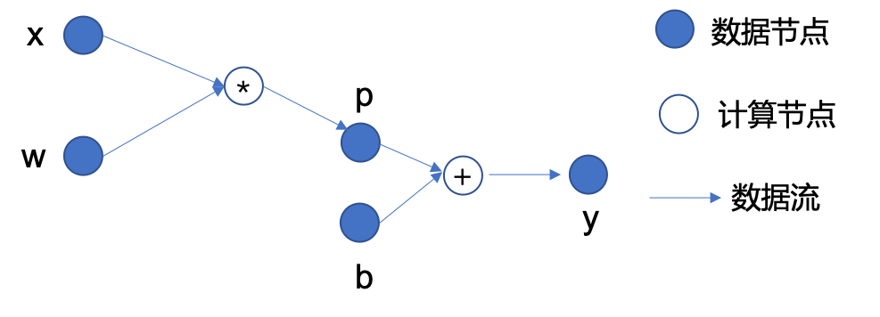
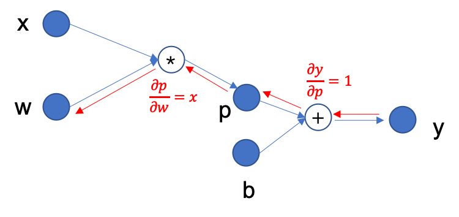

.. _basic_concepts:

基本概念
==============================

MegEngine 是基于计算图的深度神经网络学习框架。
本节内容会简要介绍计算图及其相关基本概念，以及它们在 MegEngine 中的实现。

计算图（Computation Graph）
------------------------------

我们通过一个简单的数学表达式 :math:`y = (w * x) + b` 来介绍计算图的基本概念，如下图所示：

    图1

从中我们可以看到，计算图中存在：

* 数据节点（图中的实心圈）：如输入数据 :math:`x` 、 :math:`w` 、 :math:`b` ，运算得到的中间数据 :math:`p` ，以及最终的运算输出 :math:`y` ；
* 计算节点（图中的空心圈）：图中 * 和 + 分别表示计算节点 **乘法** 和 **加法**，是施加在数据节点上的运算；
* 边（图中的箭头）：表示数据的流向，体现了数据节点和计算节点之间的依赖关系；

如上，便是一个简单的计算图示例。计算图是一个包含数据节点和计算节点的有向图（可以是有环的，也可以是无环的），
是数学表达式的形象化表示。在深度学习领域，任何复杂的深度神经网络本质上都可以用一个计算图表示出来。

**前向传播** 是计算由计算图表示的数学表达式的值的过程。在图1中，变量 :math:`x` 和 :math:`w` ，从左侧输入，首先经过乘法运算得到中间结果 :math:`p` ，
接着，:math:`p` 和输入变量 :math:`b` 经过加法运算，得到右侧最终的输出 :math:`y` ，这就是一个完整的前向传播过程。

在 MegEngine 中，我们用张量（Tensor）表示计算图中的数据节点，以及用算子（Operator）实现数据节点之间的运算。

张量（Tensor）
------------------------------

与 PyTorch，TensorFlow 等深度学习框架类似，MegEngine 使用张量（Tensor）来表示计算图中的数据。
张量（Tensor）可以看做 NumPy 中的数组，它可以是标量、向量、矩阵或者多维数组。
我们可以通过 NumPy 或者 Python List 来创建一个 Tensor 。

.. testcode::

    import numpy as np
    import megengine as mge

    # 初始化一个维度为 (2, 5) 的 ndarray，并转化成 MegEngine 的 Tensor
    # 注：目前 MegEngine Tensor 不支持 float64 数值类型，所以这里我们显式指定了 ndarray 的数值类型
    a = mge.tensor(np.random.random((2,5)).astype('float32'))
    print(a)

    # 初始化一个长度为3的列表，并转化成 Tensor
    b = mge.tensor([1., 2., 3.])
    print(b)

输出:

.. testoutput::

    Tensor([[0.2976 0.4078 0.5957 0.3945 0.9413]
    [0.7519 0.3313 0.0913 0.3345 0.3256]], device=xpux:0)

    Tensor([1. 2. 3.], device=xpux:0)

通过 :meth:`dtype <.megengine.core.tensor.Tensor.dtype>` 属性我们可以获取 Tensor 的数据类型；
通过 :meth:`~.megengine.core.tensor.Tensor.astype` 方法我们可以拷贝创建一个指定数据类型的新 Tensor ，原 Tensor 不变。

.. testcode::

    print(c.dtype)
    d = c.astype("float16")
    print(d.dtype)

输出：

.. testoutput::

    <class 'numpy.float32'>
    <class 'numpy.float16'>

通过 :meth:`shape <.megengine.core.tensor.Tensor.shape>` 属性，我们可以获取 Tensor 的形状：

.. testcode::

    print(c.shape)

输出为一个Tuple：

.. testoutput::

    (2, 5)

通过 :meth:`~.megengine.core.tensor.Tensor.numpy` 方法，我们可以将 Tensor 转换为 numpy.ndarray：

.. testcode::

    a = mge.tensor(np.arange(12)).reshape(2, 6).astype("float32")
    print(a)

    b = a.numpy()
    print(b)

输出：

.. testoutput::

    Tensor([[ 0.  1.  2.  3.  4.  5.]
    [ 6.  7.  8.  9. 10. 11.]], device=xpux:0)
    
    [[ 0.  1.  2.  3.  4.  5.]
    [ 6.  7.  8.  9. 10. 11.]]

通过 :meth:`device <.megengine.core.tensor.Tensor.device>` 属性，我们可以查询当前 Tensor 所在的设备。创建的Tensor可以位于不同device，这根据当前的环境决定。一般地，如果在创建Tensor时不指定device，其device属性默认为 xpux，表示当前任意一个可用的设备。如果存在 GPU 则优先使用 GPU，否则为 CPU。

.. testcode::

    print(a.device)

输出：

.. testoutput::

    xpux:0

你也可以在创建Tensor时，指定device为 cpu0, cpu1, ..., gpu0, gpu1, ... ，也可以是 cpux 或 gpux，表示当前任意一个可用的 CPU 或 GPU。

通过 :meth:`~.megengine.core.tensor.Tensor.to` 方法可以在另一个 device 上生成当前 Tensor 的拷贝，比如我们将刚刚创建的 Tensor ``a`` 迁移到 CPU 上，再迁移到 GPU 上：

.. testcode::

    # 下面代码是否能正确执行取决于你当前所在的环境
    b = a.to("cpu0")
    print(b.device)

    c = b.to("gpu0")
    print(c.device)

输出：

.. testoutput::

    cpu0:0
    gpu0:0

算子（Operator）
-----------------------------------------

MegEngine 中通过算子 (Operator） 来表示运算。
类似于 NumPy，MegEngine 中的算子支持基于 Tensor 的常见数学运算和操作。
下面介绍几个简单示例：

Tensor 的加法：

.. testcode::

    a = mge.tensor([[1., 2., 2.], [5., 1., 8.]])
    print(a)

    b = mge.tensor([[1., 9., 1.], [1., 7., 9.]])
    print(b)

    print(a + b)

输出：

.. testoutput::

    Tensor([[1. 2. 2.]
    [5. 1. 8.]], device=xpux:0)

    Tensor([[1. 9. 1.]
    [1. 7. 9.]], device=xpux:0)
    
    Tensor([[ 2. 11.  3.]
    [ 6.  8. 17.]], device=xpux:0)

Tensor 的切片：

.. testcode::

    print(a[1, :])

输出：

.. testoutput::

    Tensor([5. 1. 8.], device=xpux:0)

Tensor 形状的更改：

.. testcode::

    a.reshape(3, 2)

输出：

.. testoutput::

    Tensor([[1. 2.]
    [2. 5.]
    [1. 8.]], device=xpux:0)

:meth:`~.megengine.core.tensor.Tensor.reshape` 的参数允许存在单个维度的缺省值，用 -1 表示。此时，reshape 会自动推理该维度的值：

.. testcode::

    # 原始维度是 (2, 3)，当给出 -1 的缺省维度值时，可以推理出另一维度为 6
    a = a.reshape(1, -1)
    print(a.shape)

输出：

.. testoutput::

    (1, 6)

MegEngine 的 :mod:`~.megengine.functional` 提供了更多的算子，比如深度学习中常用的矩阵乘操作、卷积操作等。

Tensor 的矩阵乘：

.. testcode::

    import megengine as mge
    import megengine.functional as F

    a = mge.tensor(np.arange(6).reshape(2, 3)).astype('float32')
    print(a)
    b = mge.tensor(np.arange(6, 12).reshape(3, 2)).astype('float32')
    print(b)
    c = F.matmul(a, b)
    print(c)

输出：

.. testoutput::

    Tensor([[0. 1. 2.]
    [3. 4. 5.]], device=xpux:0)

    Tensor([[ 6.  7.]
    [ 8.  9.]
    [10. 11.]], device=xpux:0)

    Tensor([[ 28.  31.]
    [100. 112.]], device=xpux:0)

更多算子可以参见 :mod:`~.megengine.functional` 部分的文档。

反向传播和自动求导
-----------------------------

**反向传播** 神经网络的优化通常通过随机梯度下降来进行。我们需要根据计算图的输出，通过链式求导法则，对所有的中间数据节点求梯度，这一过程被称之为 “反向传播”。
例如，我们希望得到图1中输出 :math:`y` 关于输入 :math:`w` 的梯度，那么反向传播的过程如下图所示：

    图2

首先 :math:`y = p + b` ，因此 :math:`\partial y / \partial p = 1` ；
接着，反向追溯，:math:`p = w * x` ，因此，:math:`\partial p / \partial w = x` 。
根据链式求导法则，:math:`\partial y / \partial w = (\partial y / \partial p) * (\partial p / \partial w)` ，
因此最终 :math:`y` 关于输入 :math:`w` 的梯度为 :math:`x` 。

**自动求导** MegEngine 为计算图中的张量提供了自动求导功能，以上图的例子说明：
我们假设图中的 :math:`x` 是 shape 为 (1, 3) 的张量， :math:`w` 是 shape 为 (3, 1) 的张量，
:math:`b` 是一个标量。
利用MegEngine 计算 :math:`y = x * w + b` 的过程如下：

.. testcode::

    import megengine as mge
    import megengine.functional as F
    from megengine.autodiff import GradManager

    x = mge.tensor([1., 3., 5.]).reshape(1, 3)
    w = mge.tensor([2., 4., 6.]).reshape(3, 1)
    b = mge.tensor(-1.)

    gm = GradManager().attach([w, b])   # 新建一个求导器，绑定需要求导的变量
    with gm:                            # 开始记录计算图
        p = F.matmul(x, w) 
        y = p + b
        gm.backward(y)                  # 计算 y 的导数

    print(w.grad)
    print(b.grad)

输出：

.. testoutput::

    Tensor([[1.]
    [3.]
    [5.]], device=xpux:0)

    Tensor([1.], device=xpux:0)

可以看到，求出的梯度本身也是 Tensor。