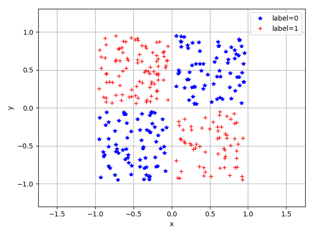
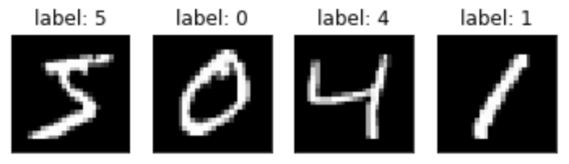
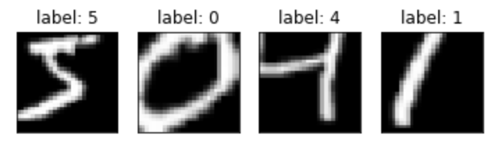

.. _data_load:

数据加载与处理
==========================================

在网络训练与测试中，数据的加载和预处理往往会耗费大量的精力。
MegEngine 提供了一系列接口来规范化这些处理工作。

利用 ``Dataset`` 封装一个数据集
-----------------------------------------

数据集是一组数据的集合，例如 MNIST、Cifar10等图像数据集。
:class:`~.megengine.data.dataset.meta_dataset.Dataset` 是 MegEngine 中表示数据集的抽象类。
我们自定义的数据集类应该继承 :class:`~.megengine.data.dataset.meta_dataset.Dataset` 并重写下列方法：

* :meth:`~.MapDataset.__init__` ：一般在其中实现读取数据源文件的功能。也可以添加任何其它的必要功能；
* :meth:`~.MapDataset.__getitem__` ：通过索引操作来获取数据集中某一个样本，使得可以通过 for 循环来遍历整个数据集；
* :meth:`~.MapDataset.__len__` ：返回数据集大小；

下面是一个简单示例。
我们根据下图所示的二分类数据，创建一个 :class:`~.megengine.data.dataset.meta_dataset.Dataset` 。
每个数据是一个二维平面上的点，横坐标和纵坐标在 [-1, 1] 之间。共有两个类别标签（图1中的蓝色 * 和红色 +），标签为0的点处于一、三象限；标签为1的点处于二、四象限。



    图1

该数据集的创建过程如下：

* 在 :meth:`~.MapDataset.__init__` 中利用 NumPy 随机生成 ndarray 作为数据；
* 在 :meth:`~.MapDataset.__getitem__` 中返回 ndarray 中的一个样本；
* 在 :meth:`~.MapDataset.__len__` 中返回整个数据集中样本的个数；

.. code-block::

    import numpy as np
    from typing import Tuple

    # 导入需要被继承的 Dataset 类
    from megengine.data.dataset import Dataset

    class XORDataset(Dataset):
        def __init__(self, num_points):
            """
            生成如图1所示的二分类数据集，数据集长度为 num_points
            """
            super().__init__()

            # 初始化一个维度为 (50000, 2) 的 NumPy 数组。
            # 数组的每一行是一个横坐标和纵坐标都落在 [-1, 1] 区间的一个数据点 (x, y)
            self.data = np.random.rand(num_points, 2).astype(np.float32) * 2 - 1
            # 为上述 NumPy 数组构建标签。每一行的 (x, y) 如果符合 x*y < 0，则对应标签为1，反之，标签为0
            self.label = np.zeros(num_points, dtype=np.int32)
            for i in range(num_points):
                self.label[i] = 1 if np.prod(self.data[i]) < 0 else 0

        # 定义获取数据集中每个样本的方法
        def __getitem__(self, index: int) -> Tuple:
            return self.data[index], self.label[index]

        # 定义返回数据集长度的方法
        def __len__(self) -> int:
            return len(self.data)

    np.random.seed(2020)
    # 构建一个包含 30000 个点的训练数据集
    xor_train_dataset = XORDataset(30000)
    print("The length of train dataset is: {}".format(len(xor_train_dataset)))

    # 通过 for 遍历数据集中的每一个样本
    for cor, tag in xor_train_dataset:
        print("The first data point is: {}, {}".format(cor, tag))
        break

    print("The second data point is: {}".format(xor_train_dataset[1]))

输出：

.. testoutput::

    The length of train dataset is: 30000
    The first data point is: [0.97255366 0.74678389], 0
    The second data point is: (array([ 0.01949105, -0.45632857]), 1)

MegEngine 中也提供了一些已经继承自 :class:`~.megengine.data.dataset.meta_dataset.Dataset` 的数据集类，方便我们使用，比如 :class:`~.megengine.data.dataset.meta_dataset.ArrayDataset` 。
:class:`~.megengine.data.dataset.meta_dataset.ArrayDataset` 允许通过传入单个或多个 NumPy 数组，对它进行初始化。其内部实现如下：

* :meth:`~.ArrayDataset.__init__` ：检查传入的多个 NumPy 数组的长度是否一致；不一致则无法成功创建；
* :meth:`~.ArrayDataset.__getitem__` ：将多个 NumPy 数组相同索引位置的元素构成一个 tuple 并返回；
* :meth:`~.ArrayDataset.__len__` ：返回数据集的大小；

以图1所示的数据集为例，我们可以通过坐标数据和标签数据的数组直接构造 :class:`~.megengine.data.dataset.meta_dataset.ArrayDataset` ，无需用户自己定义数据集类。

.. code-block::

    from megengine.data.dataset import ArrayDataset

    # 准备 NumPy 形式的 data 和 label 数据
    np.random.seed(2020)
    num_points = 30000
    data = np.random.rand(num_points, 2).astype(np.float32) * 2 - 1
    label = np.zeros(num_points, dtype=np.int32)
    for i in range(num_points):
        label[i] = 1 if np.prod(data[i]) < 0 else 0

    # 利用 ArrayDataset 创建一个数据集类
    xor_dataset = ArrayDataset(data, label)


通过 Sampler 从 Dataset 中采样
-----------------------------------------

:class:`~.megengine.data.dataset.meta_dataset.Dataset` 仅能通过一个固定的顺序（其 `__getitem__` 实现）访问所有样本，
而 :class:`~.megengine.data.sampler.Sampler` 使得我们可以以所期望的方式从 :class:`~.megengine.data.dataset.meta_dataset.Dataset` 中采样，生成训练和测试的批（minibatch）数据。
:class:`~.megengine.data.sampler.Sampler` 本质上是一个数据集中数据索引的迭代器，它接收 :class:`~.megengine.data.dataset.meta_dataset.Dataset` 的实例 和批大小（batch_size）来进行初始化。

MegEngine 中提供各种常见的采样器，如 :class:`~.megengine.data.sampler.RandomSampler` （通常用于训练）、 :class:`~.megengine.data.sampler.SequentialSampler` （通常用于测试） 等。
下面我们以它们为例，来熟悉 :class:`~.megengine.data.sampler.Sampler` 的基本用法：

.. code-block::

    # 导入 MegEngine 中采样器
    from megengine.data import RandomSampler

    # 创建一个随机采样器
    random_sampler = RandomSampler(dataset=xor_dataset, batch_size=4)

    # 获取迭代sampler时每次返回的数据集索引
    for indices in random_sampler:
        print(indices)
        break

输出：

.. testoutput::

    [19827, 2614, 8788, 8641]

可以看到，在 batch_size 为4时，每次迭代 sampler 返回的是长度为4的列表，列表中的每个元素是随机采样出的数据索引。

如果你创建的是一个序列化采样器 :class:`~.megengine.data.sampler.SequentialSampler` ，那么每次返回的就是顺序索引。

.. code-block::

    from megengine.data import SequentialSampler
    
    sequential_sampler = SequentialSampler(dataset=xor_dataset, batch_size=4)

    # 获取迭代sampler时返回的数据集索引信息
    for indices in sequential_sampler:
        print(indices)
        break

输出：

.. testoutput::

    [0, 1, 2, 3]

用户也可以继承 Sampler 自定义采样器，这里不做详述。

用 DataLoader 生成批数据
------------------------------------------

MegEngine 中，:class:`~.megengine.data.dataloader.DataLoader` 本质上是一个迭代器，它通过 :class:`~.megengine.data.dataset.meta_dataset.Dataset` 和 :class:`~.megengine.data.sampler.Sampler` 生成 minibatch 数据。

下列代码通过 for 循环获取每个 minibatch 的数据。

.. code-block::

    from megengine.data import DataLoader

    # 创建一个 DataLoader，并指定数据集和顺序采样器
    xor_dataloader = DataLoader(
        dataset=xor_dataset,
        sampler=sequential_sampler,
    )
    print("The length of the xor_dataloader is: {}".format(len(xor_dataloader)))
    # 从 DataLoader 中迭代地获取每批数据
    for idx, (cor, tag) in enumerate(xor_dataloader):
        print("iter %d : " % (idx), cor, tag)
        break

输出：

.. testoutput::

    The length of the xor_dataloader is: 7500
    iter 0 :  [[ 0.97255366  0.74678389]
     [ 0.01949105 -0.45632857]
     [-0.32616254 -0.56609147]
     [-0.44704571 -0.31336881]] [0 1 0 0]


DataLoader 中的数据变换（Transform）
-------------------------------------------

在深度学习模型的训练中，我们经常需要对数据进行各种转换，比如，归一化、各种形式的数据增广等。
:class:`~.megengine.data.transform.meta_transform.Transform` 是数据变换的基类，其各种派生类提供了常见的数据转换功能。
:class:`~.megengine.data.dataloader.DataLoader` 构造函数可以接收一个 :class:`~.megengine.data.transform.meta_transform.Transform` 参数，
在构建 minibatch 时，对该批数据进行相应的转换操作。

接下来通过 MNIST 数据集（MegEngine 提供了 MNIST Dataset）来熟悉 Transform 的使用。
首先我们构建一个不做 Transform 的 MNIST DataLoader，并可视化第一个 minibatch 数据。

.. code-block::

    # 从 MegEngine 中导入 MNIST 数据集
    from megengine.data.dataset import MNIST

    # 若你是第一次下载 MNIST 数据集，download 需设置成 True
    # 若你已经下载 MNIST 数据集，通过 root 指定 MNIST数据集 raw 路径
    # 通过 设置 train=True/False 获取训练集或测试集
    mnist_train_dataset = MNIST(root="./dataset/MNIST", train=True, download=True)
    # mnist_test_dataset = MNIST(root="./dataset/MNIST", train=False, download=True)
    sequential_sampler = SequentialSampler(dataset=mnist_train_dataset, batch_size=4)

    mnist_train_dataloader = DataLoader(
        dataset=mnist_train_dataset,
        sampler=sequential_sampler,
    )

    for i, batch_sample in enumerate(mnist_train_dataloader):
        batch_image, batch_label = batch_sample[0], batch_sample[1]
        # 下面可以将 batch_image, batch_label 传递给网络做训练，这里省略
        # trainging code ...
        # 中断
        break

    print("The shape of minibatch is: {}".format(batch_image.shape))

    # 导入可视化 Python 库，若没有请安装
    import matplotlib.pyplot as plt

    def show(batch_image, batch_label):
        for i in range(4):
            plt.subplot(1, 4, i+1)
            plt.imshow(batch_image[i][:,:,-1], cmap='gray')
            plt.xticks([])
            plt.yticks([])
            plt.title("label: {}".format(batch_label[i]))
        plt.show()

    # 可视化数据
    show(batch_image, batch_label)

输出：

.. testoutput::

    The shape of minibatch is: (4, 28, 28, 1)

可视化第一批 MNIST 数据：



    图2

然后，我们构建一个做 :class:`~.megengine.data.transform.vision.transform.RandomResizedCrop` transform 的 MNIST DataLoader，并查看此时第一个 minibatch 的图片。

.. code-block::

    # 导入 MegEngine 已支持的一些数据增强操作
    from megengine.data.transform import RandomResizedCrop

    dataloader = DataLoader(
        mnist_train_dataset,
        sampler=sequential_sampler,
        # 指定随机裁剪后的图片的输出size
        transform=RandomResizedCrop(output_size=28),
    )

    for i, batch_sample in enumerate(dataloader):
        batch_image, batch_label = batch_sample[0], batch_sample[1]
        break

    show(batch_image, batch_label)

可视化第一个批数据：



    图3

可以看到，此时图片经过了随机裁剪并 resize 回原尺寸。

组合变换（Compose Transform）
`````````````````````````````````````````````

我们经常需要做一系列数据变换。比如：

* 数据归一化：我们可以通过 :class:`~.megengine.data.transform.meta_transform.Transform` 中提供的 :class:`~.megengine.data.transform.vision.transform.Normalize` 类来实现；
* Pad：对图片的每条边补零以增大图片尺寸，通过 :class:`~.megengine.data.transform.vision.transform.Pad` 类来实现；
* 维度转换：将 (Batch-size, Hight, Width, Channel) 维度的 minibatch 转换为 (Batch-size, Channel, Hight, Width)（因为这是 MegEngine 支持的数据格式），通过 :class:`~.megengine.data.transform.vision.transform.ToMode` 类来实现；
* 其他的转换操作

为了方便使用，MegEngine 中的 :class:`~.megengine.data.transform.vision.transform.Compose` 类允许我们组合多个 Transform 并传递给 :class:`~.megengine.data.dataloader.DataLoader` 的 transform 参数。

接下来我们通过 :class:`~.megengine.data.transform.vision.transform.Compose` 类将之前的 :class:`~.megengine.data.transform.vision.transform.RandomResizedCrop` 操作与 :class:`~.megengine.data.transform.vision.transform.Normalize` 、 :class:`~.megengine.data.transform.vision.transform.Pad` 和 :class:`~.megengine.data.transform.vision.transform.ToMode` 操作组合起来，
实现多种数据转换操作的混合使用。运行如下代码查看转换 minibatch 的维度信息。

.. code-block::

    from megengine.data.transform import RandomResizedCrop, Normalize, ToMode, Pad, Compose

    # 利用 Compose 组合多个 Transform 操作
    dataloader = DataLoader(
        mnist_train_dataset,
        sampler=sequential_sampler,
        transform=Compose([
            RandomResizedCrop(output_size=28),
            # mean 和 std 分别是 MNIST 数据的均值和标准差，图片数值范围是 0~255
            Normalize(mean=0.1307*255, std=0.3081*255),
            Pad(2),
            # 'CHW'表示把图片由 (height, width, channel) 格式转换成 (channel, height, width) 格式
            ToMode('CHW'),
        ])
    )

    for i, batch_sample in enumerate(dataloader):
        batch_image, batch_label = batch_sample[0], batch_sample[1]
        break

    print("The shape of the batch is now: {}".format(batch_image.shape))

输出：

.. testoutput::

    The shape of the batch is now: (4, 1, 32, 32)

可以看到此时 minibatch 数据的 channel 维换了位置，且图片尺寸变为32。

:class:`~.megengine.data.dataloader.DataLoader` 中其他参数的用法请参考 :class:`~.megengine.data.dataloader.DataLoader` 文档。
