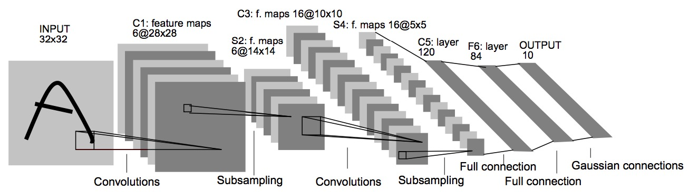

.. _network_build:

网络搭建
==============================

在 :ref:`basic_concepts` 中我们介绍了计算图、张量和算子，神经网络可以看成一个计算图。在 MegEngine 中，我们按照计算图的拓扑结构，将张量和算子连接起来，即可完成对网络的搭建。MegEngine 提供了基于 :mod:`~.megengine.functional` 和基于 :class:`~.Module` 的两种方式搭建网络。 :mod:`~.megengine.functional` 仅提供最基本的算子功能，数据连接的工作完全由用户完成； :class:`~.Module` 对网络模块（包含若干算子及其参数的基本单元）进行了进一步的封装，代码更易复用和维护。

基于 :mod:`~.megengine.functional` 搭建网络
------------------------------

:mod:`~.megengine.functional` 包提供了常用的算子函数（如 :func:`~.functional.nn.conv2d` 、 :func:`~.functional.nn.linear` 等）。这些函数接受参与计算的张量并返回计算结果。参与计算的张量通常包括两类：输入数据和该算子自身的参数，其中后者是网路中需要学习的变量。比如，二维卷积（ :func:`~.functional.nn.conv2d` ）接受多通道的二维图像作为输入数据，把卷积核作为参数，输出经卷积操作后的多通道二维图像。

算子的输入和输出数据都是 :class:`~.Tensor` 类型。算子的参数通常由 :class:`~.Parameter` 类表示。 :class:`~.Parameter` 是 :class:`~.Tensor` 的子类，其对象（即网络参数）可以被优化器更新。更多内容参见 :ref:`train_and_evaluation` 。

下面的例子实现了一个两层卷积网络（使用 `ReLU <https://en.wikipedia.org/wiki/Rectifier_(neural_networks)>`_ 作为激活函数）：

.. testcode::

    import megengine as mge
    import megengine.functional as F
    import numpy as np

    def two_layer_conv(x):
        # (8, 3, 3, 3) 代表（输出信道数，输入信道数，卷积核高度，卷积核宽度）
        conv_weight = mge.Parameter(np.random.randn(8, 3, 3, 3).astype(np.float32))
        # 对于 8 个卷积核，提供 8 个 bias
        conv_bias = mge.Parameter(np.zeros((1, 8, 1, 1), dtype=np.float32))
        x = F.conv2d(x, conv_weight, conv_bias)
        x = F.relu(x)
        conv_weight = mge.Parameter(np.random.randn(16, 8, 3, 3).astype(np.float32))
        conv_bias = mge.Parameter(np.zeros((1, 16, 1, 1), dtype=np.float32))
        x = F.conv2d(x, conv_weight, conv_bias)
        x = F.relu(x)
        return x

    # 输入形状为 (2, 3, 32, 32) 的张量
    x = mge.tensor(np.random.randn(2, 3, 32, 32).astype(np.float32))
    out = two_layer_conv(x)
    print(out.shape)  # 输出： (2, 16, 28, 28)

基于 :class:`~.Module` 搭建网络
------------------------------

在上面的代码中，对于每一个需要参数的算子，都需要单独定义其网络参数。由于“ conv + relu ”这样的组合出现了两次，代码显得臃肿。对于更加复杂的网络，这样的写法可读性、可复用性和可维护性会比较差。

为了更好的封装和复用算子， MegEngine 在 :mod:`~.megengine.functional` 基础上提供了 :mod:`~.megengine.module` 包。

:mod:`megengine.module` 包定义了抽象的网络模块基类 :class:`~.Module` 。它是构造网络的基本单元，可以被组合和叠加。它定义了网络模块的基本接口和属性，如“前向传播"等。所有 :class:`~.Module` 子类都需要实现 :class:`~.Module` 定义的两个抽象方法，介绍如下：

* :class:`__init__() <.Module>` ：在构造方法中创建这个模块，包括定义网络参数、构造和连接其子模块等工作。

* :meth:`~.Module.forward` ： 该方法定义前向传播计算流程。它接受输入数据并返回前向传播的计算结果。注意， :class:`~.Module` 对象是可被调用的 （ callable ），其实现就是 :meth:`~.Module.forward` 。

:mod:`megengine.module` 包提供了常用的网络基本模块，如 :class:`~.conv.Conv2d` 、:class:`~.linear.Linear` 等。以 :class:`~.conv.Conv2d` 为例，该类的 :class:`__init__() <.conv.Conv2d>` 方法定义并初始化卷积核参数，其 :meth:`~.conv.Conv2d.forward` 方法执行卷积操作。

基于各种常用的网络模块，我们可以方便地搭建非常复杂的网络。例如，上一个例子的网络定义可以简化成如下写法：

.. testcode::

    import megengine.module as M

    # 为了演示，我们在这里定义了一个简单的卷积模块。注意： MegEngine 已经提供了更为通用的 Conv2d 模块。
    class ConvReLU(M.Module):
        def __init__(self, in_channels, out_channels):
            # 先调用父类的初始化
            super().__init__()

            # 定义卷积权重和 bias ，作为模块参数
            self.conv_weight = mge.Parameter(np.random.randn(out_channels, in_channels, 3, 3).astype(np.float32))
            self.conv_bias = mge.Parameter(np.zeros((1, out_channels, 1, 1), dtype=np.float32))
            # 将激活函数 ReLU 作为子模块
            self.relu = M.ReLU()

        def forward(self, x):
            x = F.conv2d(x, self.conv_weight, self.conv_bias)
            x = self.relu(x)
            return x

    # 基于 ConvReLU ，定义一个两层卷积网络
    class TwoLayerConv(M.Module):
        def __init__(self):
            super().__init__()
            self.conv_relu1 = ConvReLU(3, 8)
            self.conv_relu2 = ConvReLU(8, 16)

        def forward(self, x):
            x = self.conv_relu1(x)
            x = self.conv_relu2(x)
            return x

    # 输入形状为 (2, 3, 32, 32) 的张量
    x = mge.tensor(np.random.randn(2, 3, 32, 32).astype(np.float32))
    two_layer_conv_module = TwoLayerConv()
    out = two_layer_conv_module(x)
    print(out.shape)  # 输出： (2, 16, 28, 28)

使用 :class:`~.Module` 定义的网络比使用 :mod:`~.megengine.functional` 进一步封装了内部实现，更易复用，统一的接口使得代码更易维护。 我们推荐使用 :class:`~.Module` 搭建网络。

此外， :class:`~.Module` 其它常用的方法如下：

* :meth:`~.Module.parameters` ： 该方法返回包含网络参数的迭代器。

* :meth:`~.Module.named_parameters` ： 该方法返回包含参数名称及对应网络参数的迭代器。

* :meth:`~.Module.state_dict`：返回以参数名称和网络参数为键值对的有序字典，可用于保存训练好的模型。比如，对于上面定义的 ``ConvReLU`` 模块，打印它的一个实例的 ``state_dict`` ：

.. testcode::

    conv_relu = ConvReLU(2, 3)
    print(conv_relu.state_dict())

输出的参数信息有卷积的权重项 ``'conv_weight'`` 和偏置项 ``'conv_bias'`` ：

.. testoutput::

    OrderedDict([('conv_bias', array([[[[0.]],

            [[0.]],

            [[0.]]]], dtype=float32)), ('conv_weight', array([[[[-0.53457755,  0.2799128 , -0.6624546 ],
            [-0.9222688 ,  1.2226251 , -0.5591961 ],
            [-0.45538583, -0.95166504,  1.1570141 ]],

            [[-0.89926094,  0.09956062, -0.7329557 ],
            [-0.67284465,  0.34817234,  0.6731445 ],
            [ 0.61970276,  1.8007269 ,  1.6130987 ]]],

        [[[ 1.7108068 , -1.7188625 , -0.52539474],
            [-0.04049037,  0.03099988, -1.4271212 ],
            [-0.9138133 ,  0.3976046 , -1.1582668 ]],

            [[-1.2193677 ,  0.24107741, -0.50833786],
            [ 0.9088649 , -0.2747458 , -0.1261102 ],
            [ 0.00594431,  0.65737075,  1.5280651 ]]],

        [[[ 0.24874896, -1.3824748 ,  2.2161844 ],
            [-0.6629168 ,  1.0220655 , -0.53007567],
            [ 0.37829646,  1.1993718 ,  1.0667052 ]],

            [[-0.66264534, -0.6392335 , -0.41280702],
            [ 1.7417566 ,  0.75295806, -0.4228349 ],
            [-0.94973356,  2.4136777 , -0.06665667]]]], dtype=float32))])

最后，我们来搭建更加复杂的、经典的 `LeNet <http://yann.lecun.com/exdb/publis/pdf/lecun-01a.pdf>`_ 网络，其结构如下图：

    图1 LeNet ( http://yann.lecun.com/exdb/publis/pdf/lecun-01a.pdf )

使用 :class:`~.Module` 搭建 LeNet 的代码如下：

.. testcode::

    class LeNet(M.Module):
        def __init__(self):
            super(LeNet, self).__init__()
            # 单信道图片, 两层  5x5 卷积 + ReLU + 池化
            self.conv1 = M.Conv2d(1, 6, 5)
            self.relu1 = M.ReLU()
            self.pool1 = M.MaxPool2d(2, 2)
            self.conv2 = M.Conv2d(6, 16, 5)
            self.relu2 = M.ReLU()
            self.pool2 = M.MaxPool2d(2, 2)
            # 两层全连接 + ReLU
            self.fc1 = M.Linear(16 * 5 * 5, 120)
            self.relu3 = M.ReLU()
            self.fc2 = M.Linear(120, 84)
            self.relu4 = M.ReLU()
            # 分类器
            self.classifer = M.Linear(84, 10)

        def forward(self, x):
            x = self.pool1(self.relu1(self.conv1(x)))
            x = self.pool2(self.relu2(self.conv2(x)))
            # F.flatten 将原本形状为 (N, C, H, W) 的张量x从第一个维度（即C）开始拉平成一个维度，
            # 得到的新张量形状为 (N, C*H*W) 。 等价于 reshape 操作： x = x.reshape(x.shape[0], -1)
            x = F.flatten(x, 1)
            x = self.relu3(self.fc1(x))
            x = self.relu4(self.fc2(x))
            x = self.classifer(x)
            return x

    # 输入形状为 (2, 1, 32, 32) 的张量
    x = mge.tensor(np.random.randn(2, 1, 32, 32).astype(np.float32))
    le_net = LeNet()
    # 调用网络，即执行 le_net 的 forward 成员方法，返回网络处理结果
    out = le_net(x)
    print(out.shape)  # 输出： (2, 10)
