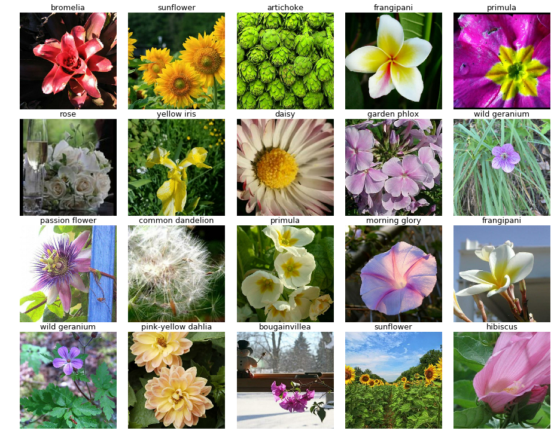

========================================
Kaggle比赛示例：Flower classification
========================================
   
让我们用MegEngine来参加一次Kaggle比赛，我选择了近期的一个比赛 `Flower Classification with TPUs`_ 作为例子，来展示如何在一个数据集上
Fine Tuning已有的模型来得到基本的效果的全过程。为了让我们的代码更加具有灵活性和可扩展性，我会尽量把相关的函数封装到一起，使得可以很容易的扩展它用于解决其他的同类问题。

1. 比赛概览
===========

自然界的物种是非常丰富多样的，有超过5000种哺乳动物，10000种鸟类，30000种鱼类-令人惊讶的是，超过400000种不同类型的花。在 `Flower Classification with TPUs`_ 中，我们需要开发模型，对数据集中104种花进行分类。
下面是其中一部分图像，你可以看到这些花的形态、颜色、种类都是丰富多样的。所以这是一个很好的用来学习用深度学习来开发分类模型的比赛。

比赛的评价指标为 `macro F1 score`_ , 如果你还不熟悉这个评价指标，可以到这个链接中去学习。

2. 问题抽象
===========

分类问题可以抽象为下面这个模型：

.. math::
    prob = f(data, \theta)

这里面:

* data是输入的数据，对这个比赛来说，可以认为是输入的一幅图像
* f是一个线性函数，它有很多参数。对于深度学习来说，f可以理解为我们的网络结构
*  :math:`\theta` 是函数的参数，这里当然就是指网络的参数，需要通过最优化方式求得
* prob是输出的向量（其值的大小简单对应着概率的大小），比如这个比赛中一幅图像来说就对应104维的向量。
  而最终我们选择最大概率值对应的label作为最终的分类预测结果

为了求得最优的 :math:`\theta` ， 还需要构建损失函数L：

.. math::
    \theta = argmin_{\theta}L(prob, label) = argmin_{\theta}L(f(data, \theta), label)
   
这里面L是一个损失函数，我们有多种损失函数的计算方式，例如对于分类问题中常用的 `Softmax with Cross Entropy`_
为了确定上面这个优化问题的解，我们有很多优化算法可供选择, 这些算法都是通过迭代计算来求解的，这里我们先把优化算法抽象为A，
那么整个求解的过程就变为了：

.. math::
  \theta = A(L, f, data, label)

这样，通过以上的描述，你可以看到，一个深度学习分类问题需要由如下几个部分组成：

- 一个高维线性函数f，即我们的网络结构
- 一堆输入数据，包括了数据的内容(data)和类别标签(label)
- 一个损失函数L
- 一个优化算法A
- 合理的把上述几者组合在一起的管理函数

以下我就分成这么几部分来介绍。

3. 步骤介绍
===========

3.1 获取数据
------------

3.1.1 原始数据介绍
*******************************************************

在比赛 `Flower Classification with TPUs`_ 的官方页面中，我们可以看到其原始数据格式是TFRecord，这是一种TensorFlow可以直接读取
的数据格式，每一个数据文件中压缩了很多图像和标签信息。

::

  .
  |-- tfrecords-jpeg-192x192
  |   |-- test
  |   |-- train
  |   `-- val
  |-- tfrecords-jpeg-224x224
  |   |-- images
  |   |-- test
  |   |-- train
  |   `-- val
  |-- tfrecords-jpeg-331x331
  |   |-- test
  |   |-- train
  |   `-- val
  `-- tfrecords-jpeg-512x512
      |-- test
      |-- train
      `-- val

  展开tfrecords-jpeg-224x224后的部分结果：
  tfrecords-jpeg-224x224
  |-- test
  |   |-- 01-224x224-462.tfrec
  |   |-- 01-224x224-462.tfrec.idx
  |   |-- 02-224x224-462.tfrec
  |   `-- 02-224x224-462.tfrec.idx
  |-- train
  |   |-- 01-224x224-798.tfrec
  |   |-- 01-224x224-798.tfrec.idx
  |   |-- 02-224x224-798.tfrec
  |   `-- 02-224x224-798.tfrec.idx
  `-- val
      |-- 01-224x224-232.tfrec
      |-- 01-224x224-232.tfrec.idx
      |-- 02-224x224-232.tfrec
      `-- 02-224x224-232.tfrec.idx

3.1.2 利用开源代码读取数据
*******************************************************

基本上，很多Kaggle比赛都会有先行者或官方提供基本的数据读取notebook供参赛者参考，而且基本上都是每个比赛的置顶或者
高赞notebook，所以我们可以很容易的找到 `这个链接`_ ,详细描述了如何读取这个比赛的数据。

你可以看到，其中提供了一段示例代码，包括3个基本函数，用于读取training数据，validation数据以及test数据。限于篇幅
的原因，我这里并不贴出所有的代码，只给出下面这点调用片段，你可以至上面这个链接中找到所有相关源码。

.. code::

  # data dump
  print("Training data shapes:")
  for image, label in get_training_dataset().take(3):
      print(image.numpy().shape, label.numpy().shape)
  print("Training data label examples:", label.numpy())
  print("Validation data shapes:")
  for image, label in get_validation_dataset().take(3):
      print(image.numpy().shape, label.numpy().shape)
  print("Validation data label examples:", label.numpy())
  print("Test data shapes:")
  for image, idnum in get_test_dataset().take(3):
      print(image.numpy().shape, idnum.numpy().shape)
  print("Test data IDs:", idnum.numpy().astype('U')) # U=unicode string

这段代码的输出结果为:
::

  Training data shapes:
  (128, 512, 512, 3) (128,)
  (128, 512, 512, 3) (128,)
  (128, 512, 512, 3) (128,)
  Training data label examples: [25  4 50 ... 84  3 49]
  Validation data shapes:
  (128, 512, 512, 3) (128,)
  (128, 512, 512, 3) (128,)
  (128, 512, 512, 3) (128,)
  Validation data label examples: [55  5 49 ...  0 67 22]
  Test data shapes:
  (128, 512, 512, 3) (128,)
  (128, 512, 512, 3) (128,)
  (128, 512, 512, 3) (128,)
  Test data IDs: ['3294a097e' 'eb0a53a24' 'd23336d37' ... '5e5acfa07' 'fd7cd952e' '075602d66']

为了方便起见，我封装了一个get_data函数如下。注意在这篇文章中，我们仅仅采用TensorFlow来解析原始的图像，
不做任何多余的处理，因此我特意设置了do_augment=False

.. code::

    def get_data(train_batch_size, valid_batch_size, test_batch_size, img_size):    
        augment_img_size = img_size
        train_data = get_training_dataset(train_batch_size, do_augment=False)
        val_data = get_validation_dataset(valid_batch_size, do_augment=False)
        test_data = get_test_dataset(test_batch_size, do_augment=False)  

        train_data_len = count_data_items(TRAINING_FILENAMES)
        val_data_len = count_data_items(VALIDATION_FILENAMES)
        test_data_len = count_data_items(TEST_FILENAMES)      

        return train_data, val_data, test_data, train_data_len, val_data_len, test_data_len

我把所有读取原始数据的代码放在了 `Kaggle Flower Classification 数据读取代码`_ 中，供你参考，你可以点击查看。

3.2. 构建网络
---------------

正如第2节所述，我们需要构建一个网络结构，作为函数f来将输入数据转换为输出的类别分布信息，我们既可以从头开始搭建特定的网络结构，
也可以采用MegEngine官方提供的预先实现的网络结构。 这里我会采用著名的 `ShuffleNet`_ ，在MegEngine官方github上有下载

为了使用它，你需要下载对应的 `网络构建Python源文件`_ ，以及 `网络参数pkl文件`_。ShuffleNet的实现根据网络的尺寸不同也有多种，
所以你需要根据自己的需要选择最合适的一种。这里我以源文件中提到的shufflenet_v2_x2_0为例来介绍。

另外，正如我在第2节提到的，我们的最终目的是要求出网络的参数 :math:`\theta` , 这就要求我们给 :math:`\theta` 一些初始值。
我们可以用MegEngine预训练好的网络参数作为初始值，在当前的数据集上进一步优化这些参数。通常，在问题类似的情况下，这会比起从0开始
优化参数能更快得到更优的结果。

官网的预训练模型是在ImageNet数据集上训练的，这个数据集一共有1000类，和我们当前的Flower数据集的类比数量不一致，因此在加载
网络预训练参数时，我们需要过滤掉跟类别相关的参数。下面这一段代码展示了如何加载一个预训练好的网络，并将类别数量设置为我们需要的数量：

.. code::

    def create_shufflenet_v2_x2_0(class_number, model_path, include_all=True):
        state_dict = mge.load(model_path)
        the_net = shufflenet_v2_x2_0(num_classes=class_number)

        if include_all:
            the_net.load_state_dict(state_dict)
        else:
            the_net.load_state_dict({
                            k: None if k.startswith('classifier')  else v
                            for k, v in state_dict.items()
                        }, strict=False)            

        return the_net   
    

3.2. 构建优化器
------------------

我们需要一个优化算法来求解第2节所提到的问题，从而求得网络的最佳参数。下面这段代码展示了构建随机梯度下降优化器的过程：

.. code::

  def get_optimizer(net, learning_rate, momotum, wd):
      # 网络优化器的创建    
      optimizer = optim.SGD(
          net.parameters(), # 参数列表
          lr=learning_rate,  # 学习速率
          momentum=momotum,
          weight_decay=wd
      )

      return optimizer

你可以通过 `MegEngineAPI手册中的Optimizer部分`_ 了解到更多优化器的使用方法。      

3.4. 构建训练函数
------------------

到目前为止，我们已经读取了数据，构建了网络以及优化器，接下来就是需要一个训练函数把这几者联系起来。至于第2节里面提到的损失函数L，
也在这里一并包含进去。

下面这段代码展示了核心的训练函数

.. code::

    def do_train(save_path, logger, net, train_data, val_data, train_data_len, val_data_len, optimizer, epochs, lr_factor, lr_steps):    
        lr_counter = 0
        
        train_scores = []
        val_scores = []
        max_val_score = -1
        for epoch in range(epochs):                
            if epoch == lr_steps[lr_counter]:
                # param_groups中包含所有需要此优化器更新的参数
                for param_group in optimizer.param_groups: 
                    # 学习速率线性递减，每过一段epochs等比例减少一次
                    param_group["lr"] *= lr_factor
                lr_counter += 1

            total_loss = 0
            all_true_labels = []
            all_predicted_labels = []    
            for step, (img, data) in enumerate(iter(train_data)):                                    
                # batch_images = mge.tensor(img)
                batch_images = train_transform.apply_batch(img.numpy())
                batch_labels = mge.tensor(data.numpy())            
                optimizer.zero_grad() # 将参数的梯度置零                 
                prob, loss = train_func(batch_images, batch_labels, opt=optimizer, net=net)
                optimizer.step()  # 根据梯度更新参数值
                total_loss += loss.numpy().item()
                
                predicted = F.argmax(prob, axis=1)
                all_true_labels.extend(list(batch_labels.numpy()))
                all_predicted_labels.extend(list(predicted.numpy()))                                                

            #比赛采用的是macro f1 score作为评判标准，因此我们用sklearn里面的f1_score函数来验证结果
            train_score = sklearn.metrics.f1_score(all_true_labels, all_predicted_labels, average="macro")
            val_score = evaluate(net, val_data)

            status = "epoch: {}, loss {}, train f1 {}, val f1 {}\n".format(epoch, total_loss, train_score,val_score)
            logger.info(status)
            session=os.path.dirname(save_path)
            display_training_curves(session, train_score, val_score, "train_val_curve", 111)

            if val_score > max_val_score:
                max_val_score = val_score
                logger.info("Saving the model with better val_score.")                        
                mge.save(net.state_dict(), save_path)  

这里，我们每次数据迭代器中获取到一批训练数据或验证时，会调用train_transform/val_transform对这批数据进行集中处理。它们的代码如下。
你可以看到，这里对于训练数据，我进行了

- 随机的上下左右翻转
- 随机的裁剪并缩放到224x224（这是我选择的网络要求的输入尺寸)
- 归一化到0~1
- 随机改变亮度/对比度/饱和度
- 转换为CHW格式，便于在GPU上计算（原始数据是HWC格式）

而对于验证数据，则只会做

- 缩放到统一尺寸并中心裁剪至224x224
- 归一化到0~1
- 转换为CHW格式，便于在GPU上计算（原始数据是HWC格式）

.. code::

    IMG_SIZE=224
    train_transform=megtrans.Compose([
        megtrans.RandomHorizontalFlip(),
        megtrans.RandomVerticalFlip(),
        megtrans.RandomResizedCrop(IMG_SIZE),
        megtrans.Normalize(),        
        megtrans.ColorJitter(brightness=0.4, contrast=0.4, saturation=0.4),
        megtrans.ToMode('CHW'),
    ])

    val_transform = megtrans.Compose([
            megtrans.Resize(256),
            megtrans.CenterCrop(IMG_SIZE),
            megtrans.Normalize(),                        
            megtrans.ToMode('CHW'),
        ])

上面这段代码会用到两个关键函数train_func和evaluate，分别用于训练和验证，我们来看看它们的代码.这里面我们采用了
`MegEngine官网介绍的静态图方式`_ ， 你可以参看这个链接了解详情。

.. code::

    trace(symbolic=True)
    def train_func(data, label, *, opt, net):
        net.train()
        prob = net(data)
        loss = F.cross_entropy_with_softmax(prob, label)
        opt.backward(loss)
        return prob, loss

    @trace(symbolic=True)
    def eval_func(data, label, *, net):
        net.eval()
        prob = net(data)
        return prob

    #Evaluate Function
    def evaluate(net, val_data):
        net.eval()
        all_true_labels = []
        all_predicted_labels = []
        for step, (img, data) in enumerate(iter(val_data)):
            batch_images = val_transform.apply_batch(img.numpy())        
            batch_labels = mge.tensor(data)
            prob = eval_func(batch_images, batch_labels, net=net)
            predicted = F.argmax(prob, axis=1)
            all_true_labels.extend(list(data))
            all_predicted_labels.extend(list(predicted.numpy()))

        f1 = sklearn.metrics.f1_score(all_true_labels, all_predicted_labels, average="macro")
        return f1

3.5. 开始训练
------------------

有了上面的函数，我们就可以把它们都连接到一起，开始训练了。下面我展示了如何调用上述函数：

.. code::

    session="20200510-1"
    os.makedirs(session, exist_ok=True)
    logger = mge.get_logger(__name__)
    mge.set_log_file(os.path.join(session, "log.txt"))
    logger.info("total class number is {}".format(len(CLASSES)))

    # Create network
    classes = len(CLASSES)
    model_path = "net/shufflenet_v2_x2_0/shufflenet/snetv2_x2_0_75115_497d4601.pkl"    
    logger.info("load saved model {}".format(model_path))
    net = create_shufflenet_v2_x2_0(classes, model_path, False)

    # Prepare optimizer
    lr = 0.01
    momentum = 0.9
    wd = 0.0001
    logger.info("optimizer: SGD, lr={}, momentum={}, wd={}".format(lr, momentum, wd))
    optimizer = get_optimizer(net, lr, momentum, wd)

    # Get data
    train_batch_size = 80
    val_batch_size = 100
    test_batch_size = 100
    augment_img_size = 224
    train_data, val_data, test_data, train_data_len, val_data_len, test_data_len = get_data(train_batch_size, val_batch_size, test_batch_size, augment_img_size)

    # Train and Validate
    logger.info("Training")
    total_epochs = 50
    lr_factor = 0.1
    lr_steps = [100, 200, np.inf]
    save_path = os.path.join(session, "mymodel.pkl")
    do_train(save_path, logger, net, train_data, val_data, train_data_len, val_data_len, optimizer, total_epochs, lr_factor, lr_steps)

上面都只是展示了代码片段，你可以点击 `Kaggle Flower Classification 训练相关代码`_ 查看完整的代码。

3.6. 测试结果
-----------------

下面这段代码片段用于输出测试集上的测试结果，完整的代码可以参见 `Kaggle Flower Classification 预测相关代码`_

.. code::

    def predict(net, test_data):
        net.eval()        
        all_predicted_labels = {}
        test_ids = []
        predicted_labels = []    
        for step, (img, data) in enumerate(iter(test_data)):        
            filenames = list(data.numpy())        
            batch_images = val_transform.apply_batch(img.numpy())                   
            prob = test_func(batch_images, mge.tensor(np.ones(len(batch_images), np.int32)), net=net)        
            predicted = F.argmax(prob, axis=1)
            test_ids.extend(filenames)
            predicted_labels.extend(predicted.numpy())        

        test_ids = [x.decode() for x in test_ids]
        return test_ids, predicted_labels

    session="20200510-1"
    print("Predicting")
    classes = len(CLASSES)
    save_path = os.path.join(session, "mymodel.pkl")
    load_net = create_shufflenet_v2_x2_0(classes, save_path, include_all=True)
    test_ids, predicted_labels = predict(load_net, test_data)
    np.savetxt('submission.csv', np.rec.fromarrays([test_ids, predicted_labels]), fmt=['%s', '%d'], delimiter=',', header='id,label', comments='')

我通过以上代码训练了50次左右，在验证集上的评价结果大约为macro f1 score = 0.918左右，而提交到Kaggle上后，在测试集上得分为0.89553。这个得分当然不高，
但我相信你通过阅读和练习本文所述的方法，已经掌握了使用MegEngine进行完整训练的过程。

4. 完整代码列表
====================

- `Kaggle Flower Classification 数据读取代码`_
- `Kaggle Flower Classification 训练相关代码`_
- `Kaggle Flower Classification 预测相关代码`_

.. _`Flower Classification with TPUs`: https://www.kaggle.com/c/flower-classification-with-tpus
.. _`macro F1 score`: https://www.kaggle.com/c/flower-classification-with-tpus/overview/evaluation
.. _`Softmax with Cross Entropy`: https://megengine.org.cn/doc/latest/autogen/megengine.functional.html#megengine.functional.loss.cross_entropy_with_softmax
.. _`这个链接`: https://www.kaggle.com/mgornergoogle/getting-started-with-100-flowers-on-tpu
.. _`ShuffleNet`: https://github.com/MegEngine/Models/tree/master/official/vision/classification/shufflenet
.. _`网络构建Python源文件`: https://raw.githubusercontent.com/MegEngine/Models/master/official/vision/classification/shufflenet/model.py
.. _`网络参数pkl文件`: https://data.megengine.org.cn/models/weights/snetv2_x2_0_75115_497d4601.pkl
.. _`MegEngine官网介绍的静态图方式`: https://megengine.org.cn/doc/latest/basic/dynamic_and_static_graph.html
.. _`MegEngineAPI手册中的Optimizer部分`: https://megengine.org.cn/doc/latest/autogen/megengine.optimizer.html
.. _`Kaggle Flower Classification 数据读取代码`: kaggle_raw_data_functions.html
.. _`Kaggle Flower Classification 训练相关代码`: kaggle_train_code.html
.. _`Kaggle Flower Classification 预测相关代码`: kaggle_predict_code.html